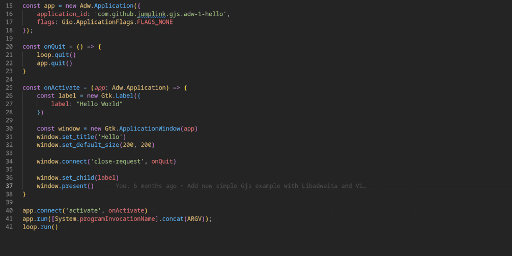

<p align="center">
  
  <h1 align="center">TS <small>for</small> GIR</h1>
</p>

<p align="center">
  
  
  
  
</p>

<p align="center">TypeScript type definition generator for GObject introspection GIR files</p>

<p align="center">
  
</p>

`ts-for-gir` is a robust [TypeScript](https://www.typescriptlang.org/) type definitions generator that improves the development experience of [GJS](https://gitlab.gnome.org/GNOME/gjs/) projects. It has been completely rewritten over time to provide a more complete and accurate TypeScript representation of the [GObject introspection](https://gi.readthedocs.io/en/latest/) interfaces. With `ts-for-gir`, developers can now benefit from TypeScript's strong typing and improved code navigation, making it easier to build robust and powerful applications with GJS.

# Branch 'main' - Next Version

You are on the `main` branch. These are the next features of `ts-for-gir` v4.x where `ts-for-gir` is merged with [gi.ts](https://github.com/gjsify/gi.ts).

`main` branch: https://github.com/gjsify/ts-for-gir/tree/main  
`3.x` branch: https://github.com/gjsify/ts-for-gir/tree/3.x

## Getting Started

Install the latest LTS version of Node.js. We recommend using [NVM](https://github.com/nvm-sh/nvm) for this purpose. After Node.js has been installed, `ts-for-gir` can be executed with the following command:

```bash
npx @ts-for-gir/cli --help
```

That's it, you can start generating your types 👩‍💻☕

To generate TypeScript definitions for Gtk 4.0:

```bash
npx @ts-for-gir/cli generate Gtk-4.0
```

For detailed CLI options and advanced usage, see the [CLI documentation](/packages/cli/README.md).

## Example Projects

The repository includes numerous example projects that demonstrate how to use the generated TypeScript definitions with various bundlers and libraries. These examples serve as great starting points for your own GJS applications.

**Popular examples:**
- [GTK 4 Template with Vite](/examples/gtk-4-template-vite) - Modern UI with Vite bundling
- [GTK 3 Browser](/examples/gtk-3-browser) - Web browser using WebKit
- [Gio File Operations](/examples/gio-2-cat) - File system operations with Gio

See the [Examples directory](/examples/README.md) for a complete list of examples with screenshots and detailed descriptions. For information on using the examples with different CLI options, refer to the [CLI documentation](/packages/cli/README.md#using-the-generated-types).

## NPM Packages

If you are only interested in the types and do not want to generate them yourself, you can use our pre-generated NPM packages. For example, if you want to develop a Gtk4 application with GJS, it is enough to install the corresponding NPM packages:

```bash
npm install @girs/gjs @girs/gtk-4.0 --save
```

```ts
import '@girs/gjs'
import '@girs/gjs/dom'
import '@girs/gtk-4.0'

import Gtk from 'gi://Gtk?version=4.0';

const button = new Gtk.Button();
```

All pre-generated NPM packages can be found on [gjsify/types](https://github.com/gjsify/types).

> You want your or any other missing GObject introspection based library types to be published on NPM for every release? Then feel free to create an issue for it, we will be happy to include it.

## Project Structure

ts-for-gir consists of several packages:

- [`@ts-for-gir/cli`](/packages/cli) - Command-line interface for generating TypeScript definitions
- [`@gi.ts/parser`](/packages/parser) - Parser for GObject Introspection XML files
- [`@ts-for-gir/lib`](/packages/lib) - Core library for processing GIR data
- [`@ts-for-gir/reporter`](/packages/reporter) - Reporting system for problems and statistics with dependency injection
- [`@ts-for-gir/generator-typescript`](/packages/generator-typescript) - TypeScript definition generator
- [`@ts-for-gir/generator-html-doc`](/packages/generator-html-doc) - HTML documentation generator (experimental)

## Maintainer Wanted for node-gtk Support

Version 3.x has working [node-gtk](https://github.com/romgrk/node-gtk) support. This is currently not planned for version 4.x. We ourselves want to focus on GJS support. However, if there is a need in the community to maintain node-gtk support, then we are looking for a maintainer for that. Feel free to get in touch 🤓

## Further Information

- [Examples](/examples/README.md) - Detailed examples showing TypeScript with different bundlers
- [CLI Documentation](/packages/cli/README.md) - Comprehensive guide to CLI options and features
- [Development](/DEVELOPMENT.md) - Learn how you can contribute to this project
- [gjsify/types](https://github.com/gjsify/types) - Pre-generated NPM packages you can use directly
- [GNOME Shell Extension Types](https://github.com/gjsify/gnome-shell) - Experimental hand-written type definitions for GNOME Shell Extensions
