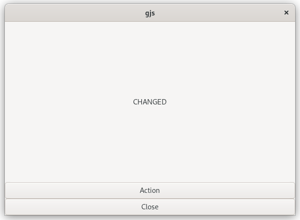
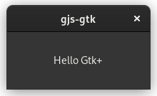

# ts-for-gjs

[TypeScript](https://www.typescriptlang.org/) binding generator for
[GJS](https://wiki.gnome.org/Projects/Gjs) and
[node-gtk](https://github.com/romgrk/node-gtk) (in a very early stage).  Inspired by
[gir2dts](https://github.com/darkoverlordofdata/gir2dts) but re-written and
re-designed to be a more thorough TypeScript description of the [GObject
introspection](https://wiki.gnome.org/Projects/GObjectIntrospection)
interfaces.

The definitions can be used for both TypeScript or JavaScript projects.

## Install

```bash
git clone https://github.com/sammydre/ts-for-gjs
cd ts-for-gjs
git submodule update --init
npm install
npm link
```

### CLI

Run `npm link`, this is similar to `npm -g install ts-for-gir` but links to your local development repository which allows you to test your changes directly.

Now you can execute `ts-for-gir` anywhere on your system:

```bash
ts-for-gir --help
```

Alternatively, you can run

```bash
npm run start -- --help
```

to test your changes, this will run `ts-for-gir` with `ts-node`, so you don't need to rebuild the package for this.

## Usage

After you have linked this project you can use the `ts-for-gir` command in you project:

```bash
$ ts-for-gir --help

Typescript .d.ts generator from GIR for gjs or node-gtk

Commands:
  ts-for-gir generate [modules..]  Generates .d.ts files from GIR for gjs or nod
                                   e-gtk
  ts-for-gir list [modules..]      Lists all available GIR modules

Options:
  --version  Show version number                                       [boolean]
  --help     Show help                                                 [boolean]
```

### Generate .d.ts files

```bash
$ ts-for-gir generate --help

ts-for-gir generate [modules..]

Generates .d.ts files from GIR for gjs or node-gtk

Options:
      --version          Show version number                           [boolean]
      --help             Show help                                     [boolean]
      --modules          GIR modules to load, e.g. 'Gio-2.0'. Accepts multiple m
                         odules                         [array] [default: ["*"]]
  -g, --girDirectories   GIR directories
                                       [array] [default: ["/usr/share/gir-1.0"]]
  -o, --outdir           Directory to output to   [string] [default: "./@types"]
  -e, --environments     Javascript environment
                      [array] [choices: "gjs", "node"] [default: ["gjs","node"]]
  -i, --ignore           Modules that should be ignored    [array] [default: []]
  -b, --buildType        Definitions generation type
                             [string] [choices: "lib", "types"] [default: "lib"]
  -t, --moduleType       Specify what module code is generated.
                     [string] [choices: "esm", "commonjs"] [default: "commonjs"]
      --pretty           Prettifies the generated .d.ts files
                                                       [string] [default: false]
  -v, --verbose          Switch on/off the verbose mode [string] [default: true]
      --ignoreConflicts  Do not ask for package versions if multiple versions ar
                         e found                       [string] [default: false]
  -p, --print            Print the output to console and create no files
                                                       [string] [default: false]
      --configName       Name of the config if you want to use a different name
                                                                        [string]
  -d, --useNamespace     Export all symbols for each module as a namespace
                                                       [string] [default: false]
  -n, --noComments       Do not generate documentation comments
                                                       [string] [default: false]

Examples:
  ts-for-gir generate                       Run 'ts-for-gir generate' in your gj
                                            s or node-gtk project to generate ty
                                            pings for your project, pass the gir
                                             modules you need for your project
  ts-for-gir generate Gtk*                  You can also use wild cards
  ts-for-gir generate '*'                   If you want to parse all of your loc
                                            ally installed gir modules run
  ts-for-gir generate '*' -e gjs            Generate .d.ts. files only for gjs
  ts-for-gir generate '*' -e node           Generate .d.ts. files only for node
  ts-for-gir generate --configName='.ts-fo  Use a special config file
  r-gir.gtk4.rc.js
  ts-for-gir generate --ignore=Gtk-3.0 xra  Generate .d.ts. files but not for Gt
  ndr-1.3                                   k-3.0 and xrandr-1.3
```

### List available GIR modules

```bash
$ ts-for-gir list --help
 
ts-for-gir list [modules..]

Lists all available GIR modules

Options:
      --version         Show version number                            [boolean]
      --help            Show help                                      [boolean]
      --modules         GIR modules to load, e.g. 'Gio-2.0'. Accepts multiple mo
                        dules                           [array] [default: ["*"]]
  -g, --girDirectories  GIR directories[array] [default: ["/usr/share/gir-1.0"]]
  -i, --ignore          Modules that should be ignored     [array] [default: []]
  -v, --verbose         Switch on/off the verbose mode  [string] [default: true]
      --configName      Name of the config if you want to use a different name
                                                                        [string]

Examples:
  ts-for-gir list -g ./vala-girs/gir-1.0    Lists all available GIR modules in .
                                            /vala-girs/gir-1.0
  ts-for-gir list --ignore=Gtk-3.0 xrandr-  Lists all available GIR modules in /
  1.3                                       usr/share/gir-1.0 but not Gtk-3.0 an
                                            d xrandr-1.3
```

### Generate HTML documentation

```bash
$ ts-for-gir doc --help

ts-for-gir doc [modules..]

The HTML documentation generator is not yet implemented, but feel free to implem
ent it 🤗
```
### Config

In addition to the option of passing options as a CLI flag, you can also write them in a config file.
To do that, create a new config file called `.ts-for-girrc.js` in your project root directory, like this:

```js
export default {
  pretty: false,
  print: false,
  verbose: true,
  environments: ['gjs', 'node'],
  outdir: '@types',
  girDirectories: '/usr/share/gir-1.0',
  modules: ['*'],
  ignore: [],
  useNamespace: true,
  buildType: 'lib',
  moduleType: 'esm'
}
```

### About the `--moduleType esm` option

Gjs now supports ES modules, which can be activated with its `gjs -m` flag. Using this in conjunction with `"module": "es6"` in tsconfig.json is generally more
convenient than using the `imports` global object, because you no longer have to provide an implementation of `require`. However, it creates two new
problems for Typescript/ts-for-gjs. The first is that `gi` imports use a URI format, which Typescript doesn't support yet. To work around this problem
you can import from a relative filename as usual, and the Javascript stubs generated by ts-for-gjs now forward the imports from the `gi` URI.

Or you can use a bundler like Webpack to handle the imports, the [example/gjs/browser](example/gjs/browser) uses esm and does exactly this.

The second problem is that in ES module mode, `gi` imports behave as if they were exported by `export default`, which is not backwards compatible with
ts-for-gjs. Where you would previously write:

`import * as Gtk from "<path to gi bindings>/Gtk-4.0js"`

you now have to write:

`import Gtk from "<path to gi bindings>/Gtk-4.0js"`

Destructuring individual items in the import statement is not supported for this type of import.

See `examples/Gjs/browser` for an example for Gjs with ESM. 

## Examples

Go to the examples directory and run `npm run start`, this will build the types and the example and then run it.
You can also use the configurations of the examples as a template.

Now open some code with an editor that understands TypeScript and see what happens, for example
[Visual Studio Code](https://code.visualstudio.com/).

```bash
code examples/gjs/browser
```
### Browser


This example uses ESM when building the types and executing Gjs.
On Node.js ESM is converted back to CommonJS (as long as node-gtk doesn't support ESM), but this way the types can still be used in ESM format.

See also [About the `--moduleType esm` option](#about-the---moduletype-esm-option).

Source: [Gjs](/examples/Gjs/browser), [node-gtk](/examples/node-gtk/browser)

Build and run:
```bash
cd /examples/Gjs/browser
npm run start

# or for node-gtk
cd /examples/node-gtk/browser
npm run start
```

### Builder


Source: [Gjs](/examples/Gjs/builder), [node-gtk](/examples/node-gtk/builder)

Build and run:
```bash
cd /examples/Gjs/builder
npm run start

# or for node-gtk
cd /examples/node-gtk/builder
npm run start
```

### Editor


Source: [Gjs](/examples/Gjs/editor), [node-gtk](/examples/node-gtk/editor)

Build and run:
```bash
cd /examples/Gjs/editor
npm run start

# or for node-gtk
cd /examples/node-gtk/editor
npm run start
```

### Hello Gtk


Source: [Gjs](/examples/Gjs/hello-gtk), [node-gtk](/examples/node-gtk/hello-gtk)

Build and run:
```bash
cd /examples/Gjs/hello-gtk
npm run start

# or for node-gtk
cd /examples/node-gtk/hello-gtk
npm run start
```

## What it's like


## Development

Install GObject Introspection Repository files:

```bash
# Ubuntu 18.04
sudo apt update && sudo apt install \
    libappindicator3-dev \
    libgda-5.0-dev \
    libgirepository1.0-dev \
    libgtk-3-dev \
    libgtksourceview-3.0-dev \
    libnotify-dev \
    libsoup2.4-dev \
    libwebkit2gtk-4.0-dev

# Fedora 35
sudo dnf update && sudo dnf install \
    libappindicator-gtk3-devel \
    libgda-devel \
    gobject-introspection-devel \
    gtk3-devel \
    gtksourceview3-devel \
    libnotify-devel \
    libsoup-devel \
    webkit2gtk3-devel
```

Generate example type definitions:

```bash
npm run regress
```
### Gir XML Format

See [gobject-introspection/docs/gir-1.2.rnc](https://gitlab.gnome.org/GNOME/gobject-introspection/-/blob/master/docs/gir-1.2.rnc) for type definitions.

### Debugging

It is strongly recommended to use the debugger. For Visual Studio Code there are some predefined launch configurations for it. Take a look at the following video:

https://user-images.githubusercontent.com/1073989/150143112-1c0a2dab-3d4c-4472-818f-8404a620cc53.mp4

### NPM Scripts

#### Validate

To validate all your generated type definition files in this project run 

```bash
npm run validate:types:all
```

To validate only your type definition files for Gjs

```bash
npm run validate:types:gjs
```

To validate only your type definition files for node-gtk

```bash
npm run validate:types:node
```

You can also validate a single type definition file like this

```bash
npm run validate -- ./@types/Gjs/GObject-2.0.d.ts
```


### Test

#### Ava

To run our [ava](https://github.com/avajs/ava) tests just run:

```bash
npm run test:ava
```

#### Test gir files

We have a test which tries to generate the type definition files for all gir files from the [vala-girs](https://github.com/nemequ/vala-girs) repository.

Before you can run this test you need to checkout the vala-girs submodule, to do that run this in the root of ts-for-gjs:

```bash
git submodule update --init
```

Now you can run the test with

```bash
npm run test:girs:gjs
npm run test:girs:node
# or npm run test:girs:all
```

## Related Projects

### TypeScript Type Definitions

* [gnome-gtk](https://github.com/codejamninja/gnome-gtk) - Typescript bindings for gnome gtk
* [ts-gir](https://github.com/codejamninja/ts-gir) - Typescript bindings for GJS
* [node-gir-typedef](https://github.com/SolarLiner/node-gir-typedef) - TypeScript bindings for node-gir
* [gir2dts](https://github.com/darkoverlordofdata/gir2dts) - The project this is inspired by
* [gir-dts-generator](https://github.com/Place1/gir-dts-generator) - The project that inspired this project
* [gjs-ts](https://github.com/niagr/gjs-ts) - Typescript bindings for GJS
* [Typescript Doclet](https://github.com/gjsify/doclet) - Experimental TypeScript binding generator written in Vala as a Valadoc extension
* [gi.ts](https://gitlab.gnome.org/ewlsh/gi.ts) - Highly accurate TypeScript bindings for GJS

### Other

* [gjs-docs](https://github.com/apla/gjs-docs) - GJS documentation server written using gjs
* [node-gtk](https://github.com/romgrk/node-gtk) - GIO bindings for NodeJS
* [cgjs](https://github.com/cgjs/cgjs) - A NodeJS / CommonJS Runtime for GJS
* [jsgtk](https://github.com/WebReflection/jsgtk) - Replaced by cgjs
* [vala-girs](https://github.com/nemequ/vala-girs) - Collection of GIRs and VAPIs for the Vala toolchain
* [gjs-examples](https://github.com/optimisme/gjs-examples) - GJS examples showing how to build Gtk javascript applications
* [hello-gjs-npm](https://github.com/jo/hello-gjs-npm) - Gjs example using Babel and Rollup
* [vala-object](https://github.com/antono/vala-object) - Set of examples of how you can build native code with Vala and use it in Gjs, Node.js and other environments
