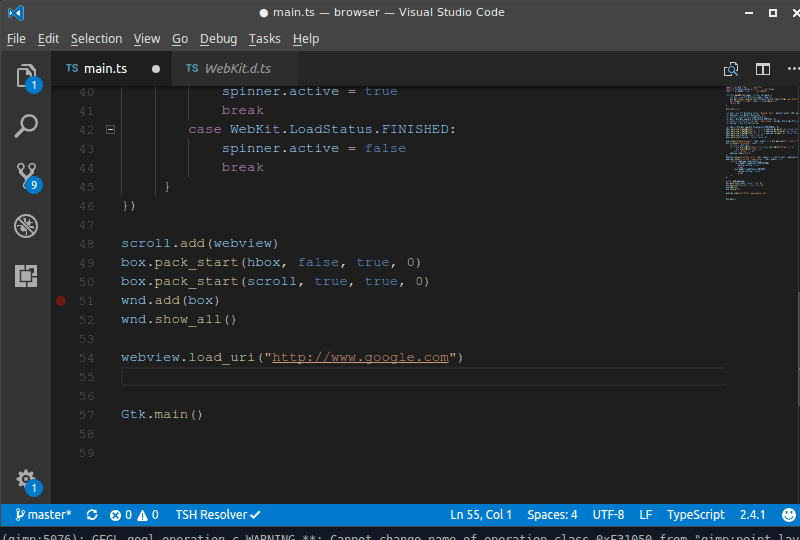

# ts-for-gjs

[TypeScript](https://www.typescriptlang.org/) binding generator for
[GJS](https://wiki.gnome.org/Projects/Gjs) and
[node-gtk](https://github.com/romgrk/node-gtk) (in a very early stage).  Inspired by
[gir2dts](https://github.com/darkoverlordofdata/gir2dts) but re-written and
re-designed to be a more thorough TypeScript description of the [GObject
introspection](https://wiki.gnome.org/Projects/GObjectIntrospection)
interfaces.

The definitions can be used for both TypeScript or JavaScript projects.

## Install

```bash
git clone https://github.com/sammydre/ts-for-gjs
cd ts-for-gjs
npm install
npm link
```

## Usage

After you have linked this project you can use the `ts-for-gir` command in you project:

```bash
$ ts-for-gir --help  
Typescript .d.ts generator from GIR for gjs or node-gtk

VERSION
  ts-for-gir/1.0.0 linux-x64 node-v12.14.1

USAGE
  $ ts-for-gir [COMMAND]

COMMANDS
  generate  Generates .d.ts files from GIR for gjs or node-gtk
  help      display help for ts-for-gir
  list      Lists all available GIR modules
```

### Generate .d.ts files

```bash
$ ts-for-gir generate --help                                                                                                                                                       :(
Generates .d.ts files from GIR for gjs or node-gtk

USAGE
  $ ts-for-gir generate MODULES

ARGUMENTS
  MODULES  [default: *] GIR modules to load, e.g. 'Gio-2.0'. Accepts multiple modules

OPTIONS
  -b, --buildType=lib|types            [default for gjs: lib, default for node: types] Force the definitions generation type
  -e, --environments=gjs|node          [default: gjs,node] javascript environment
  -g, --girDirectories=girDirectories  [default: /usr/share/gir-1.0] GIR directory
  -h, --help                           show CLI help
  -i, --ignore=ignore                  [default: ] modules that should be ignored
  -o, --outdir=outdir                  [default: @types] directory to output to
  -p, --print                          print the output to console and create no files
  -v, --verbose                        Switch on/off the verbose mode
  --configName=configName              name of the config if you want to use a different name
  --ignoreConflicts                    Do not ask for package versions if multiple versions are found
  --pretty                             prettifies the generated .d.ts files

EXAMPLES
  # Run 'ts-for-gir generate' in your gjs or node-gtk project to generate typings for your project, pass the gir modules you need for your project
  ts-for-gir generate

  # You can also use wild cards
  ts-for-gir generate Gtk*

  # If you want to parse all of your locally installed gir modules run
  ts-for-gir generate '*'

  # Generate .d.ts. files only for gjs
  ts-for-gir generate '*' -e gjs

  # Generate .d.ts. files only for node
  ts-for-gir generate '*' -e node

  # Use a special config file
  ts-for-gir generate --configName='.ts-for-gir.gtk4.rc.js

  # Generate .d.ts. files but not for Gtk-3.0 and xrandr-1.3
  ts-for-gir generate --ignore=Gtk-3.0 xrandr-1.3
```

### List available GIR modules

```bash
$ ts-for-gir list --help
Lists all available GIR modules

USAGE
  $ ts-for-gir list MODULES

ARGUMENTS
  MODULES  [default: *] GIR modules to load, e.g. 'Gio-2.0'. Accepts multiple modules

OPTIONS
  -g, --girDirectories=girDirectories  [default: /usr/share/gir-1.0] GIR directory
  -h, --help                           show CLI help
  -i, --ignore=ignore                  [default: true] modules that should be ignored
  -v, --verbose                        Switch on/off the verbose mode
  --configName=configName              name of the config if you want to use a different name

EXAMPLES
  # Lists all available GIR modules in ./vala-girs/gir-1.0
  ts-for-gir list -g ./vala-girs/gir-1.0

  # Lists all available GIR modules in /usr/share/gir-1.0 but not Gtk-3.0 and xrandr-1.3
  ts-for-gir list --ignore=Gtk-3.0 xrandr-1.3
```

### Config

In addition to the option of passing options as a CLI flag, you can also write them in a config file.
To do that, create a new config file called `.ts-for-girrc.js` in your project root directory, like this:

```js
module.exports = {
    pretty: false,
    print: false,
    verbose: true,
    environments: ['gjs', 'node'],
    outdir: '@types',
    girDirectories: '/usr/share/gir-1.0',
    modules: ['*'],
    ignore: [],
}
```

## Examples

Run `npm run regress` or `ts-for-gir --configName='.ts-for-gir.regress.rc.js'` in the root of this project to generate the type definitons for the examples

Now open some code with an editor that understands TypeScript and see what happens, for example
[Visual Studio Code](https://code.visualstudio.com/).

```bash
code examples/gjs/browser
```

## What it's like



## Development

Install GObject Introspection Repository files:

```bash
# Ubuntu 18.04
sudo apt update && sudo apt install \
    libappindicator3-dev \
    libgda-5.0-dev \
    libgirepository1.0-dev \
    libgtk-3-dev \
    libgtksourceview-3.0-dev \
    libnotify-dev \
    libsoup2.4-dev \
    libwebkit2gtk-4.0-dev
```

Generate example type definitions:

```bash
npm run regress
```

### CLI

Run `npm link`, this is similar to `npm -g install ts-for-gir` but links to your local development repository which allows you to test your changes directly.

Now you can execute `ts-for-gir` anywhere on your system:

```bash
ts-for-gir --help
```

### Test

#### Ava

To run our [ava](https://github.com/avajs/ava) tests just run:

```bash
npm run test:ava
```

#### Test gir files

We have a test wich tries to generate the type definition files for all gir files from the [vala-girs](https://github.com/nemequ/vala-girs) repository.

Before you can run this test you need to checkout the vala-girs submodule, to do that run this in the root of ts-for-gjs:

```bash
git submodule update --init
```

Now you can run the test with

```bash
npm run test:girs
```

## Related Projects

### TypeScript Type Definitions

* [gnome-gtk](https://github.com/codejamninja/gnome-gtk) - Typescript bindings for gnome gtk
* [ts-gir](https://github.com/codejamninja/ts-gir) - Typescript bindings for GJS
* [node-gir-typedef](https://github.com/SolarLiner/node-gir-typedef) - TypeScript bindings for node-gir
* [gir2dts](https://github.com/darkoverlordofdata/gir2dts) - The project this is inspired by
* [gir-dts-generator](https://github.com/Place1/gir-dts-generator) - The project that inspired this project
* [gjs-ts](https://github.com/niagr/gjs-ts) - Typescript bindings for GJS

### Other

* [gjs-docs](https://github.com/apla/gjs-docs) - GJS documentation server written using gjs
* [node-gtk](https://github.com/romgrk/node-gtk) - GIO bindings for NodeJS
* [cgjs](https://github.com/cgjs/cgjs) - A NodeJS / CommonJS Runtime for GJS
* [jsgtk](https://github.com/WebReflection/jsgtk) - Replaced by cgjs
* [vala-girs](https://github.com/nemequ/vala-girs) - Collection of GIRs and VAPIs for the Vala toolchain
