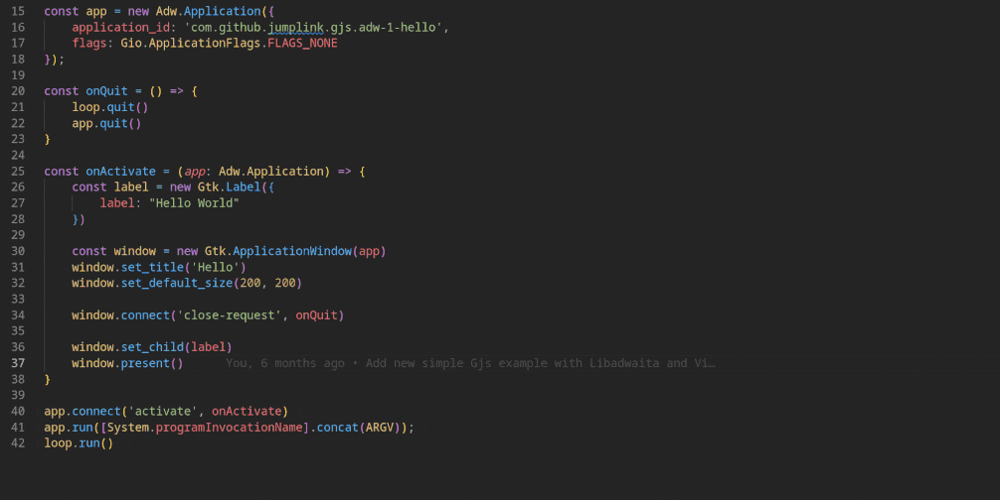

<p align="center">
  
  <h1 align="center">TS <small>for</small> GIR</h1>
</p>

<p align="center">
  
  
  
  
</p>

<p align="center">TypeScript type definition generator for GObject introspection GIR files</p>

<p align="center">
  
</p>

`ts-for-gir` is a robust [TypeScript](https://www.typescriptlang.org/) type definitions generator that improves the development experience of [GJS](https://gitlab.gnome.org/GNOME/gjs/) projects. It has been completely rewritten over time to provide a more complete and accurate TypeScript representation of the [GObject introspection](https://gi.readthedocs.io/en/latest/) interfaces. With `ts-for-gir`, developers can now benefit from TypeScript's strong typing and improved code navigation, making it easier to build robust and powerful applications with GJS.

## Getting Started

Install the latest LTS version of Node.js. We recommend using [NVM](https://github.com/nvm-sh/nvm) for this purpose. After Node.js has been installed, `ts-for-gir` can be executed with the following command:

```bash
npx @ts-for-gir/cli --help
```

That's it, you can start generating your types 👩‍💻☕

To generate TypeScript definitions for Gtk 4.0:

```bash
npx @ts-for-gir/cli generate Gtk-4.0
```

For detailed CLI options and advanced usage, see the [CLI documentation](/packages/cli/README.md).

**Debug Generation Issues:**
If you encounter type generation problems, enable the reporter and use the analyze command:
```bash
npx @ts-for-gir/cli generate Gtk-4.0 --reporter
npx @ts-for-gir/cli analyze -f ./ts-for-gir-report.json
```

## Showcase

**GNOME Applications**

* [Audio Player](https://flathub.org/apps/org.gnome.Decibels) - Play audio files
* [Counters](https://flathub.org/apps/io.gitlab.guillermop.Counters) - Keep track of anything
* [Ignition](https://flathub.org/apps/io.github.flattool.Ignition) - Manage startup apps and scripts
* [Learn 6502](https://flathub.org/apps/eu.jumplink.Learn6502) - Learn program vintage Game Consoles
* [Sound Recorder](https://flathub.org/apps/org.gnome.SoundRecorder) - A simple, modern sound recorder
* [Sticky Notes](https://flathub.org/apps/com.vixalien.sticky) - Pin notes to your desktop
* [Weather](https://flathub.org/apps/org.gnome.Weather) - Show weather conditions and forecast
* [K’uychi](https://flathub.org/en/apps/one.naiara.Kuychi) - Generate color palettes

**GNOME Shell Extensions**

* [gTile](https://github.com/gTile/gTile) - Tiling window management for GNOME Shell
* [Copyous](https://github.com/boerdereinar/copyous) - Clipboard manager for GNOME Shell
* [Rounded Window Corners](https://github.com/flexagoon/rounded-window-corners) - Add rounded corners to windows

## Example Projects

Looking for a starting point? These example projects demonstrate how to use the TypeScript definitions with various bundlers:

- [GTK 4 Template with Vite](/examples/gtk-4-template-vite) - Modern UI with Vite bundling
- [GNOME TypeScript Template](https://codeberg.org/nyx_lyb3ra/gnome-ts-template) - A template using GTK, libadwaita, TypeScript, Flatpak, and Meson

More examples with screenshots and descriptions can be found in the [Examples directory](/examples/README.md). For information on using the examples with different CLI options, refer to the [CLI documentation](/packages/cli/README.md#using-the-generated-types).

## NPM Packages

If you are only interested in the types and do not want to generate them yourself, you can use our pre-generated NPM packages. For example, if you want to develop a Gtk4 application with GJS, it is enough to install the corresponding NPM packages:

```bash
npm install @girs/gjs @girs/gtk-4.0 --save
```

```ts
import '@girs/gjs'
import '@girs/gjs/dom'
import '@girs/gtk-4.0'

import Gtk from 'gi://Gtk?version=4.0';

const button = new Gtk.Button();
```

All pre-generated NPM packages can be found on [gjsify/types](https://github.com/gjsify/types).

> You want your or any other missing GObject introspection based library types to be published on NPM for every release? Then feel free to create an issue for it, we will be happy to include it.

## Project Structure

ts-for-gir consists of several packages:

- [`@ts-for-gir/cli`](/packages/cli) - Command-line interface for generating TypeScript definitions and analyzing reports
- [`@gi.ts/parser`](/packages/parser) - Parser for GObject Introspection XML files
- [`@ts-for-gir/lib`](/packages/lib) - Core library for processing GIR data
- [`@ts-for-gir/reporter`](/packages/reporter) - Reporting system for problems and statistics with dependency injection
- [`@ts-for-gir/generator-typescript`](/packages/generator-typescript) - TypeScript definition generator
- [`@ts-for-gir/generator-html-doc`](/packages/generator-html-doc) - HTML documentation generator (experimental)

### Types submodules

This repo contains two Git submodules for pre-generated types:

- `types-dev` (branch `dev`): used during local development. Scripts write generated packages here.
- `types-release` (branch `main`): updated by the release workflow on tags.

Useful scripts:

```bash
yarn build:types          # generates into ./types-dev
yarn build:types:release  # generates into ./types-release
```

## Further Information

- [Examples](/examples/README.md) - Detailed examples showing TypeScript with different bundlers
- [CLI Documentation](/packages/cli/README.md) - Comprehensive guide to CLI options and features
- [gjsify/types](https://github.com/gjsify/types) - Pre-generated NPM packages you can use directly
- [GNOME Shell Extension Types](https://github.com/gjsify/gnome-shell) - Hand-written type definitions for GNOME Shell Extensions
