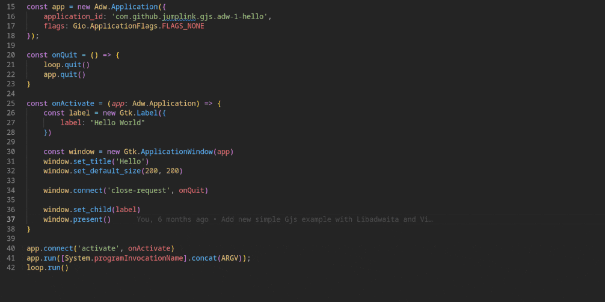

<p align="center">
  
  <h1 align="center">TS <small>for</small> GIR</h1>
</p>

<p align="center">
  
  
  
  
</p>

<p align="center">TypeScript type definition generator for GObject introspection GIR files</p>

<p align="center">
  
</p>

`ts-for-gir` reads [GObject Introspection](https://gi.readthedocs.io/en/latest/) data and writes TypeScript definitions for [GJS](https://gitlab.gnome.org/GNOME/gjs/) projects. Your editor then knows the whole GNOME stack: jump to definition, autocompletion, and a type error when you pass the wrong thing to `g_object_set()`.

**Project page on the gjsify website**: [gjsify.github.io/gjsify/projects/ts-for-gir](https://gjsify.github.io/gjsify/projects/ts-for-gir/). Install paths, quickstart, generator usage, and links to the [Patterns](https://gjsify.github.io/gjsify/patterns/) docs.

Browse the full **[TypeScript API Documentation](https://gjsify.github.io/docs)** for GLib, GTK, GStreamer, and more.

## Quick Start

```bash
gjsify dlx @ts-for-gir/cli create my-app   # no install, no Node.js
# or
npx @ts-for-gir/cli create my-app          # via npm
```

Pick a template interactively, or pass `--template <id>`:

| Template | Best for |
|---|---|
| **`types-gjsify`** | A GJS app with no Node.js. Install, build, run and format all go through [gjsify](https://gjsify.github.io/gjsify/) |
| **`types-npm`** | Single-package, types from [`@girs/*`](https://github.com/gjsify/types) NPM, esbuild + node |
| **`types-locally`** | Generate types into `./@types/` (no `@girs/*` dep) |
| **`types-workspace`** | npm workspace with `@girs/*` as locally-generated workspace packages |

```bash
cd my-app && npm start    # or `gjsify run start` for types-gjsify
```

## Installation

### GJS, without Node.js

```bash
curl -fsSL https://raw.githubusercontent.com/gjsify/ts-for-gir/main/install.js -o /tmp/install.js
gjs -m /tmp/install.js && rm /tmp/install.js
```

Installs to `~/.local/bin/`. Update later with `ts-for-gir self-update`. Powered by [GJSify](https://gjsify.github.io/gjsify/).

If you already have the [gjsify CLI](https://gjsify.github.io/gjsify/), skip that. `gjsify dlx @ts-for-gir/cli <args>` runs it without installing, `gjsify install -g @ts-for-gir/cli` installs it globally.

### Node.js

```bash
npx @ts-for-gir/cli --help
# or globally:
npm install -g @ts-for-gir/cli
```

## CLI Usage

```bash
ts-for-gir generate Gtk-4.0                          # generate types for a single module
ts-for-gir generate Gtk-4.0 --reporter               # with diagnostics
ts-for-gir analyze -f ./ts-for-gir-report.json       # inspect the report
ts-for-gir --help                                    # all commands
```

See the [CLI documentation](/packages/cli/README.md) for advanced options.

## Pre-generated NPM Packages

If you just want the types without generating them yourself:

```bash
npm install @girs/gjs @girs/gtk-4.0
```

```ts
import "@girs/gjs";
import "@girs/gjs/dom";
import "@girs/gtk-4.0";

import Gtk from "gi://Gtk?version=4.0";

const button = new Gtk.Button();
```

All packages are listed at [gjsify/types](https://github.com/gjsify/types). Missing a module? [Open an issue](https://github.com/gjsify/ts-for-gir/issues).

## Building a GNOME app that ships as a Flatpak

A Flathub build runs in a sandbox **without network access**, and the GNOME SDK ships no
Node.js. Both facts shape what a TypeScript port needs, and neither is specific to
ts-for-gir — your build system stays Meson.

### Does the type generator belong in the build?

Decide this first, because it determines everything downstream.

| You need types for | Generator in the Flatpak build? | How the types get there |
| --- | --- | --- |
| Public GNOME modules (`Gtk-4.0`, `Adw-1`, …) | **No** | `@girs/*` from npm — types-only, erased at compile time, nothing ships |
| Your own private or vendored `.gir` | Preferably not | Generate once on a machine that has the `.gir`, commit the output |
| A `.gir` that must be re-read on every build | Yes | And the generator itself now has to be vendored like any other dependency |

The common case is the first row, and it is the cheap one: because `@girs/*` is
type-only, **no npm package ends up inside the app**. A Flatpak of a TypeScript GNOME
app carries a bundle, exactly like a JavaScript one.

### Vendoring the build-time dependencies

Everything the build needs must therefore be in the manifest's `sources`, which is the
mechanism Flatpak uses for "this may come from the internet". Note the two phases:
`flatpak-builder` downloads every `sources` entry **with** network and verifies its
checksum *before* the build starts, then runs the build itself offline. So the
downloads are allowed and the install is not.

1. Commit one lockfile.
2. Generate a `sources` file from it, one entry per locked tarball with its checksum.
3. Reference that file next to your `type: "dir"` source, and point the installer's
   cache at the directories `flatpak-builder` just filled.
4. Ship the bundle, not `node_modules`.

[`flatpak-node-generator`](https://github.com/flatpak/flatpak-builder-tools) does step
2 from an `npm`/`yarn`/`pnpm` lockfile and is all you need. Keep steps 1 and 2 in sync:
they are written by *different* commands, so adding a dependency and regenerating only
the lockfile leaves every local check green and fails the Flatpak job much later.

Meson drives the TypeScript step through `run_command` or a `custom_target`, and that
shell-out runs **inside** the offline sandbox — it has to consume the same pre-populated
cache as everything else.

Node itself is a `sdk-extension` (`org.freedesktop.Sdk.Extension.node24`), not a
dependency you vendor. Two details that cost time: name it **without a branch** — a
pinned `//25.08` makes `flatpak-builder` look for that branch against the GNOME runtime
version and fail — and note that an extension only *mounts* at `/usr/lib/sdk/node24`, so
the module's `build-options` must add that `bin` directory to `PATH` before Meson can
find `npm`.

Two ready-made paths, if either fits:

- `gjsify dlx @ts-for-gir/cli create my-app --template types-flatpak` — a Meson +
  Flatpak scaffold wired up this way, with no Node.js on the runtime path.
- [`gjsify flatpak sources`](https://gjsify.github.io/gjsify/guides/flatpak-app/) does
  step 2 for gjsify, npm, yarn and pnpm lockfiles, without Python.

## Showcase

**GNOME Applications**

- [Audio Player](https://flathub.org/apps/org.gnome.Decibels): Play audio files
- [Counters](https://flathub.org/apps/io.gitlab.guillermop.Counters): Keep track of anything
- [Ignition](https://flathub.org/apps/io.github.flattool.Ignition): Manage startup apps and scripts
- [Learn 6502](https://flathub.org/apps/eu.jumplink.Learn6502): Learn programming on vintage game consoles
- [Sound Recorder](https://flathub.org/apps/org.gnome.SoundRecorder): A simple, modern sound recorder
- [Sticky Notes](https://flathub.org/apps/com.vixalien.sticky): Pin notes to your desktop
- [Weather](https://flathub.org/apps/org.gnome.Weather): Show weather conditions and forecast
- [K'uychi](https://flathub.org/en/apps/one.naiara.Kuychi): Generate color palettes

**GNOME Shell Extensions**

- [gTile](https://github.com/gTile/gTile): Tiling window management for GNOME Shell
- [Copyous](https://github.com/boerdereinar/copyous): Clipboard manager for GNOME Shell
- [Rounded Window Corners](https://github.com/flexagoon/rounded-window-corners): Add rounded corners to windows

## Example Projects

These example projects wire the definitions up with different bundlers:

- [GTK 4 Template with Vite](/examples/gtk-4-template-vite): Modern UI with Vite bundling
- [GNOME TypeScript Template](https://codeberg.org/nyx_lyb3ra/gnome-ts-template): A template using GTK, libadwaita, TypeScript, Flatpak, and Meson

The [Examples directory](/examples/README.md) has more, with screenshots. The [CLI documentation](/packages/cli/README.md#using-the-generated-types) covers running them under different CLI options.

## Project Structure

ts-for-gir consists of several packages:

- [`@ts-for-gir/cli`](/packages/cli): Command-line interface for generating TypeScript definitions, documentation, and analyzing reports
- [`@gi.ts/parser`](/packages/parser): Parser for GObject Introspection XML files
- [`@ts-for-gir/lib`](/packages/lib): Core library for processing GIR data
- [`@ts-for-gir/reporter`](/packages/reporter): Reporting system for problems and statistics with dependency injection
- [`@ts-for-gir/generator-typescript`](/packages/generator-typescript): TypeScript definition generator
- [`@ts-for-gir/generator-json`](/packages/generator-json): TypeDoc JSON generator with GIR metadata enrichment
- [`@ts-for-gir/generator-html-doc`](/packages/generator-html-doc): HTML documentation generator using TypeDoc
- [`@ts-for-gir/generator-base`](/packages/generator-base): Shared base class for generators
- [`@ts-for-gir/typedoc-theme`](/packages/typedoc-theme): Custom TypeDoc theme inspired by gi-docgen
- [`@ts-for-gir/gir-module-metadata`](/packages/gir-module-metadata): Curated metadata (descriptions, logos, licenses) for GIR namespaces
- [`@ts-for-gir/templates`](/packages/templates): Template files for generated packages (tsconfig, typedoc config, ambient declarations)
- [`@ts-for-gir/tsconfig`](/packages/tsconfig): Shared TypeScript configuration
- [`@ts-for-gir/language-server`](/packages/language-server): Language server for GIR files (experimental)

### Submodules

This repo contains Git submodules for pre-generated types and documentation:

- `types-dev` (branch `dev`): used during local development. Scripts write generated packages here.
- `types-release` (branch `main`): updated by the release workflow on tags.
- `docs` (branch `main`): generated HTML documentation, deployed to [gjsify.github.io/docs](https://gjsify.github.io/docs).

Useful scripts:

```bash
gjsify run build:types          # regenerate into ./types-dev
gjsify run build:types:release  # regenerate into ./types-release
gjsify run build:doc            # build HTML docs into ./docs
```

## Further Reading

- [TypeScript API Documentation](https://gjsify.github.io/docs)
- [Examples](/examples/README.md)
- [CLI Documentation](/packages/cli/README.md)
- [Using ts-for-gir as a library](/packages/lib/README.md#using-ts-for-gir-as-a-library): building
  your own TSX or framework types from GIR, and which of the three routes needs no library at all
- [Publishing `@girs/*`](/PUBLISHING.md): how a 716-package set is released, why sibling ranges
  are carets, and the ordering defect that left 513 of v4.9.0's 716 packages uninstallable for
  up to two hours
- [gjsify/types](https://github.com/gjsify/types): pre-generated NPM packages
- [gjsify/gnome-shell](https://github.com/gjsify/gnome-shell): hand-written Shell Extension types
