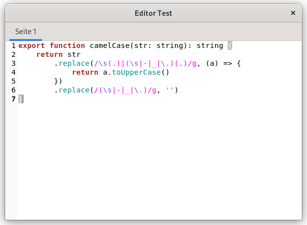
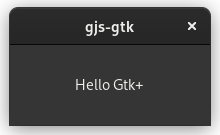
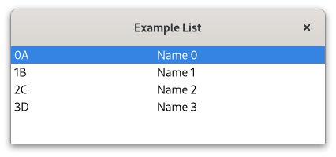

# Examples

Go to the examples directory and run `yarn run start`, this will build the types and the example and then run it.
You can also use the configurations of the examples as a template.

Now open some code with an editor that understands TypeScript and see what happens, for example
[Visual Studio Code](https://code.visualstudio.com/).

```bash
code examples/gjs/browser
```
## Gtk-3.0 Browser


This example uses ESM when building the types and executing GJS.
On Node.js ESM is converted back to CommonJS (as long as node-gtk doesn't support ESM), but this way the types can still be used in ESM format.

Source: [GJS](gjs/gtk-3-browser), [node-gtk](node-gtk/gtk-3-browser)  
Bundler: Webpack  
Module: ESM  

Build and run:
```bash
cd /examples/gjs/gtk-3-browser
yarn run start

# or for node-gtk
cd /examples/node-gtk/gtk-3-browser
yarn run start
```

## Gtk-3.0 Builder


Source: [GJS](gjs/gtk-3-builder), [node-gtk](node-gtk/gtk-3-builder)  
Bundler: Webpack  
Module: CommonJS    

Build and run:
```bash
cd /examples/gjs/gtk-3-builder
yarn run start

# or for node-gtk
cd /examples/node-gtk/gtk-3-builder
yarn run start
```

## Gtk-3.0 Editor


Source: [GJS](gjs/gtk-3-editor), [node-gtk](node-gtk/gtk-3-editor)  
Bundler: Webpack  
Module: CommonJS    

Build and run:
```bash
cd /examples/gjs/gtk-3-editor
yarn run start

# or for node-gtk
cd /examples/node-gtk/gtk-3-editor
yarn run start
```

## Gtk-3.0 Hello Gtk


Source: [GJS](gjs/gtk-3-hello), [node-gtk](node-gtk/gtk-3-hello)  
Bundler: Webpack  
Module: CommonJS    

Build and run:
```bash
cd /examples/gjs/gtk-3-hello
yarn run start

# or for node-gtk
cd /examples/node-gtk/gtk-3-hello
yarn run start
```

## Gtk-4.0 ListStore


GJS example showing how to build Gtk4 applications using `Gtk.TreeView` and `Gtk.ListStore`

Source: [GJS](gjs/gtk-4-list-store)  
Bundler: ESBuild  
Module: ESM  

Build and run:
```bash
cd /examples/gjs/gtk-4-list-store
yarn run start
```

## HTTP Server + Client

```
> gjs -m dist/http-server.js
Visit http://localhost:1080
```

```
> gjs -m dist/http-client.js
Gjs-Message: 21:13:22.007: JS LOG: status: 200 - OK
Gjs-Message: 21:13:22.007: JS LOG: Date: Wed, 06 Apr 2022 19:13:22 GMT
Gjs-Message: 21:13:22.007: JS LOG: Content-Type: text/html; charset=utf-8
Gjs-Message: 21:13:22.007: JS LOG: Content-Length: 135
Gjs-Message: 21:13:22.008: JS LOG: body:

        <html>
        <body>
            Hello, gjs! ☺<br>
            <a href="/">Go back</a>
        </body>
        </html>
```


GJS example showing how to build a http server/client using Soap 3.  
This example contains a client and a server example, for the client example the server must be running. You can also start the server from the node-gtk example and then request that with the gjs example and vice versa ;)

Source: [GJS](gjs/soup-3-http), [node-gtk](node-gtk/soup-3-http)  
Bundler: ESBuild  
Module: ESM  

Build and run:
```bash
cd /examples/gjs/soup-3-http
yarn run build
yarn run start:server
yarn run start:client

# or for node-gtk
cd /examples/node-gtk/soup-3-http
yarn run build
yarn run start:server
yarn run start:client
```

## Gtk4 Custom Widget


This example shows the usage of custom widgets and virtual functions in GJS and node-gtk.

Source: [GJS](gjs/gtk-4-custom-widget), [node-gtk](node-gtk/gtk-4-custom-widget)  
Bundler: ESBuild  
Module: ESM    

Build and run:
```bash
cd /examples/gjs/gtk-4-custom-widget
yarn run start

# or for node-gtk
cd /examples/node-gtk/gtk-4-custom-widget
yarn run start
```