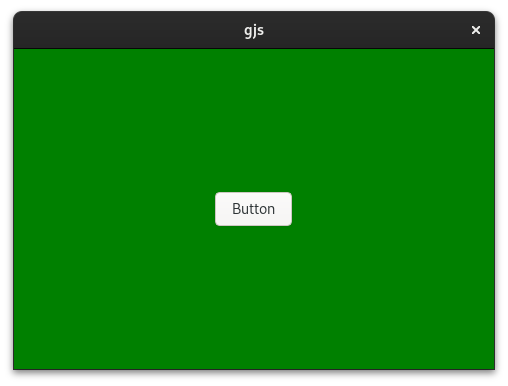
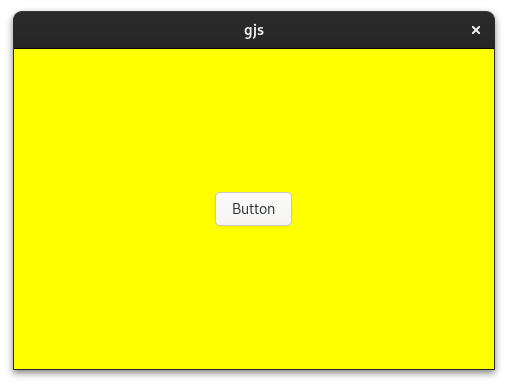
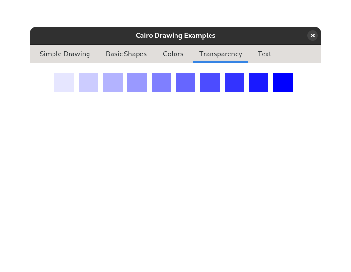
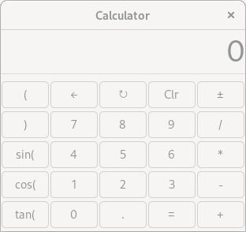
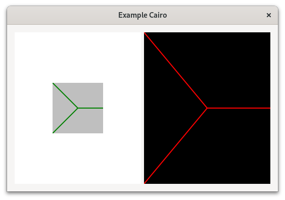

# Examples

This directory contains various examples showing how to use TypeScript with GJS applications. Each example demonstrates different libraries, features, and bundlers to help you get started with your own projects.

## About the Examples

Each example:
- Uses TypeScript with GJS
- Demonstrates TypeScript type definitions generated by ts-for-gir
- Shows how to configure various bundlers or the TypeScript compiler
- Can be used as a starting point for your own projects

To use an example:
1. Go to the example directory
2. Run `yarn install` to install dependencies
3. Run `yarn build` to build the example
4. Run `yarn start` to run the example

The examples use the `@girs/*` NPM packages for TypeScript definitions. These are pre-generated type definitions that you can also generate yourself using the ts-for-gir CLI with the `--package` option. For more information on CLI options, see the [CLI documentation](/packages/cli/README.md).

## Quality Assurance and Testing

All examples in this directory are part of our Continuous Integration (CI) pipeline. They are:
- Built during CI runs
- Validated for TypeScript type correctness
- Many are even executed as part of automated tests

This process ensures that our generated TypeScript definitions correctly match the GObject introspection data and work as expected in real applications. When issues with the type definitions are discovered, we often create or adapt examples to cover those edge cases and prevent regressions.

If you encounter a situation where the generated types don't work correctly, we encourage you to:
1. Create a minimal example demonstrating the issue
2. Submit it as a pull request
3. Or open an issue with details about the problem

This collaborative approach helps us improve the quality of the type definitions for everyone.

## Available Examples

### GTK 4 Examples

| Example | Description | Bundler |
|---------|-------------|---------|
| [GTK 4 Template (Vite)](gtk-4-template-vite) | Modern UI with Vite for template and CSS loading | Vite |
| [GTK 4 Template (esbuild)](gtk-4-template-esbuild) | Template-based UI using esbuild for asset loading | esbuild |
| [GTK 4 Template (TSC)](gtk-4-template-tsc) | Pure TypeScript compilation with runtime asset loading | TSC |
| [GTK 4 ListStore](gtk-4-list-store) | Data management with TreeView and ListStore | esbuild |
| [GTK 4 Custom Widget](gtk-4-custom-widget) | Creating custom widgets and virtual functions | esbuild |

### GTK 3 Examples

| Example | Description | Bundler |
|---------|-------------|---------|
| [GTK 3 Browser](gtk-3-browser) | Web browser using WebKit | Webpack |
| [GTK 3 Builder](gtk-3-builder) | UI design with Glade/Builder | Webpack |
| [GTK 3 Calculator](gtk-3-calc) | Simple calculator application | esbuild |
| [GTK 3 Clutter](gtk-3-clutter-tsc) | Graphics with Clutter integration | TSC |
| [GTK 3 Editor](gtk-3-editor) | Text editor application | Parcel |
| [GTK 3 Hello World](gtk-3-hello) | Minimal GTK 3 application | Rollup |

### Libadwaita Examples

| Example | Description | Bundler |
|---------|-------------|---------|
| [Adwaita Hello World](adw-1-hello) | Modern GNOME UI with Libadwaita | Vite |

### Gio and Other Libraries

| Example | Description | Bundler |
|---------|-------------|---------|
| [Gio Cat](gio-2-cat) | File system operations with Gio | esbuild |
| [Gio DBus](gio-2-dbus) | DBus client/server communication | esbuild |
| [Soup HTTP](soup-3-http) | HTTP client/server with Soup 3 | esbuild |

## How to Run Examples

For most examples, you can use:

```bash
cd examples/<example-directory>
yarn install
yarn start
```

Some examples like the DBus and HTTP examples have separate client and server parts:

```bash
# For DBus example
cd examples/gio-2-dbus
yarn install
yarn build
yarn start:server  # In one terminal
yarn start:client  # In another terminal

# For HTTP example
cd examples/soup-3-http
yarn install
yarn build
yarn start:server  # In one terminal
yarn start:client  # In another terminal
```

## TypeScript Configuration

Each example includes a `tsconfig.json` file that shows how to configure TypeScript for GJS applications. This typically includes:

- Setting the module system to ESNext
- Configuring the appropriate lib and types
- Including the necessary GIR type declarations

For example:

```json
{
  "compilerOptions": {   
    "lib": ["ESNext"],
    "types": ["@girs/gjs", "@girs/gjs/dom", "@girs/gio-2.0", "@girs/glib-2.0", "@girs/gtk-4.0", "@girs/adw-1"],
    "target": "ESNext",
    "module": "ESNext",
    "moduleResolution": "bundler",
    "strict": true,
    "outDir": "dist"
  },
  "include": ["src/**/*"],
  "exclude": ["node_modules"]
}

```

## Using with Different Type Generation Methods

The examples can be used with different methods of type generation:

1. **Pre-generated NPM packages**: Most examples use `@girs/*` packages from npm (e.g., `@girs/gtk-4.0`)
2. **Local generation with CLI**: You can generate types directly using the CLI:
   ```bash
   npx @ts-for-gir/cli generate Gtk-4.0 --outdir ./@types
   ```

For more information on CLI options and type generation, see the [CLI documentation](/packages/cli/README.md).

## Contributing Examples

Feel free to contribute new examples that showcase:
- Different libraries from the GObject ecosystem
- Different bundlers or build systems
- Interesting UI patterns or application architectures
- Advanced TypeScript features with GJS

If you discover cases where the generated type definitions don't work correctly, creating a minimal example that demonstrates the issue can be extremely helpful for us to fix it.

## Example Previews

Here are visual previews of the examples:

### GTK 4 Examples

#### GTK 4 Template (Vite)


#### GTK 4 Template (esbuild)


#### GTK 4 Template (TSC)


#### GTK 4 ListStore


#### GTK 4 Custom Widget


### Cairo Examples

#### Cairo Drawing


### GTK 3 Examples

#### GTK 3 Browser


#### GTK 3 Builder


#### GTK 3 Calculator


#### GTK 3 Clutter


#### GTK 3 Editor


#### GTK 3 Hello World


### Libadwaita Examples

#### Adwaita Hello World
