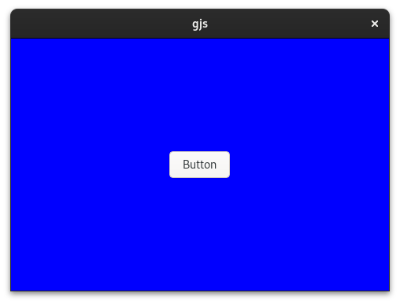

# Examples

Go to the examples directory and run `yarn start`, this will build the example and then run it.
You can also use the examples as a template for your own project. The examples intentionally use different bundlers like [Webpack](https://webpack.js.org/), [Rollup](https://rollupjs.org/), [Esbuild](https://esbuild.github.io/), [Vite](https://vitejs.dev/), [Parcel](https://parceljs.org/) or the pure TypeScript compiler to transpile the TypeScript files to JavaScript. Simply choose the example that best suits your needs. If there is no suitable one, feel free to create an issue for it or contribute a new example via a PR.

Now open some code with an editor that understands TypeScript and see what happens, for example
[Visual Studio Code](https://code.visualstudio.com/).


## Adwaita Hello World


A simple Libadwaita example

Source: [adw-1-hello](adw-1-hello)  
Bundler: Vite  

Build and run:
```bash
cd /examples/adw-1-hello
yarn start
```

## Gio-2.0 Cat

A simple GJS example that shows how to use Gio-2.0 to read a file from the local file system

Source: [gio-2-cat](gio-2-cat)  
Bundler: Esbuild  

Build and run:
```bash
cd /examples/gio-2-cat
yarn start
```

## Gio-2.0 DBus

A simple GJS example that shows how to build a DBus server/client

Source: [gio-2-dbus](gio-2-dbus)  
Bundler: Esbuild  

Build the server and client:
```bash
cd /examples/gio-2-dbus
yarn build
```

Run the server:
```bash
yarn start:server
```

Run the client:
```bash
yarn start:client
```

## Gtk-3.0 Browser


A simple browser using Gtk-3.0 and WebKit-2.0

Source: [gtk-3-browser](gtk-3-browser)  
Bundler: Webpack  

Build and run:
```bash
cd /examples/gtk-3-browser
yarn start
```

## Gtk-3.0 Builder


Source: [gtk-3-builder](gtk-3-builder)  
Bundler: Webpack  

Build and run:
```bash
cd /examples/gtk-3-builder
yarn start
```

## Gtk-3.0 Editor


Source: [gtk-3-editor](gtk-3-editor)  
Bundler: Parcel  

Build and run:
```bash
cd /examples/gtk-3-editor
yarn start
```

## Gtk-3.0 Hello Gtk


Source: [gtk-3-hello](gtk-3-hello)  
Bundler: Rollup    

Build and run:
```bash
cd /examples/gtk-3-hello
yarn start
```

## Gtk-4.0 ListStore


GJS example showing how to build Gtk4 applications using `Gtk.TreeView` and `Gtk.ListStore`

Source: [gtk-4-list-store](gtk-4-list-store)  
Bundler: ESBuild  

Build and run:
```bash
cd /examples/gtk-4-list-store
yarn start
```

## HTTP Server + Client

```
> gjs -m dist/http-server.js
Visit http://localhost:1080
```

```
> gjs -m dist/http-client.js
Gjs-Message: 21:13:22.007: JS LOG: status: 200 - OK
Gjs-Message: 21:13:22.007: JS LOG: Date: Wed, 06 Apr 2022 19:13:22 GMT
Gjs-Message: 21:13:22.007: JS LOG: Content-Type: text/html; charset=utf-8
Gjs-Message: 21:13:22.007: JS LOG: Content-Length: 135
Gjs-Message: 21:13:22.008: JS LOG: body:

        <html>
        <body>
            Hello, gjs! ☺<br>
            <a href="/">Go back</a>
        </body>
        </html>
```


GJS example showing how to build a http server/client using Soap 3.  
This example contains a client and a server example, for the client example the server must be running.

Source: [soup-3-http](soup-3-http)  
Bundler: ESBuild  

Build and run:
```bash
cd /examples/soup-3-http
yarn build
yarn start:server
yarn start:client
```

## Gtk4 Custom Widget


This example shows the usage of custom widgets and virtual functions in GJS.

Source: [gtk-4-custom-widget](gtk-4-custom-widget)  
Bundler: ESBuild    

Build and run:
```bash
cd /examples/gtk-4-custom-widget
yarn start
```

## Gtk4 Template


This example shows how to use the Gtk4 template engine to create a custom widget.

Source: [gtk-4-template](gtk-4-template)  
Bundler: ESBuild    

Build and run:
```bash
cd /examples/gtk-4-template
yarn start
```

## Gtk4 Template (Vite)


This example is largely identical to the example above, but uses Vite to inject the template `.ui` file into the source code.

Source: [gtk-4-template-vite](gtk-4-template-vite)  
Bundler: Vite    

Build and run:
```bash
cd /examples/gtk-4-template-vite
yarn start
```